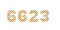
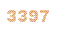
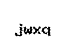
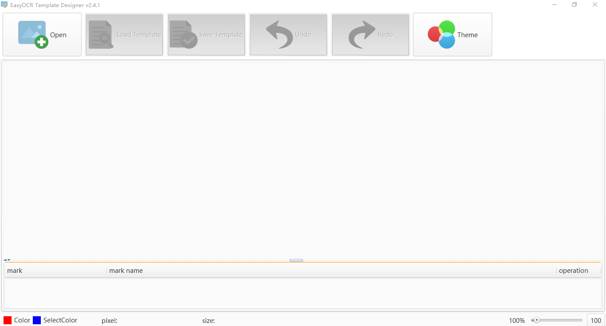
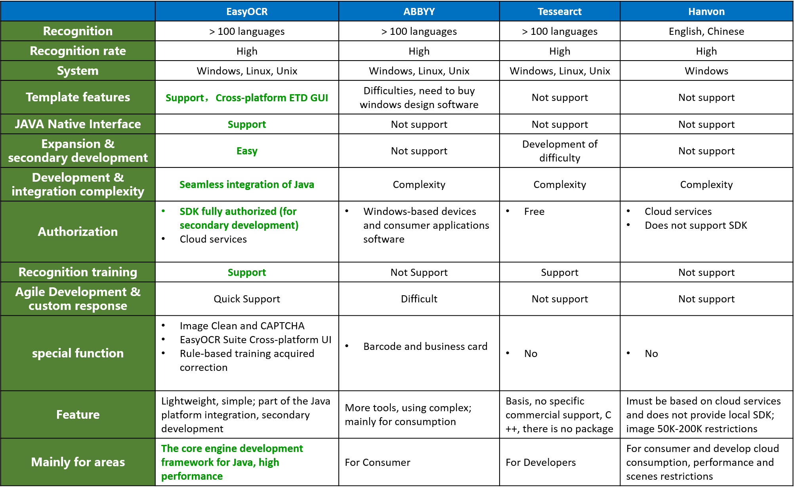

# EasyOCR

---------------


EasyOCR is a Java language using OCR recognition engine (based Tesseract). By means of a few simple API, the Java language can be used to complete the picture content identification work. And integrated image cleanup, recognition CAPTCHA CAPTCHA image, notes and other content integration efforts.

EasyOCR not only provide services for consumers, but mainly oriented to provide localized development SDK integration with C / S, B / S and Android mobile terminal native integration projects.

EasyOCR 4.X new architecture on the line, the latest version 4.2.0.


## Main feature

- API minimalist, a method, a line of code to complete

- Pure localization SDK, JAVA native support, can be used as engine integrated into various projects to support the Android mobile terminal integrated

- Support for API-level recognition whitelist limited, limited recognition range

- Supports hundreds of speech recognition, and supports mixed language recognition, such as: English + Japanese + German

- Specifically for common bills verification code image cleanup, identifying achieve integration, built-in multiple common types of CAPTCHA Options

- Support for custom plug-ins, the ability to write extensions to clean up the image recognition based on the integration EasyOCR

- ETD template support, ETD template provides a graphical design tool (EasyTemplateDesigner), accurately controllable improve the recognition rate

- EasyOCR Suite suite supports cross-platform GUI, provide design and use of tools for developers and consumers

- Standard input and output, Socket network interface support input and output

- Support recognition training, rules-based modification of results in training, so recognition accuracy and reasonableness, acquired the ability to provide growth

- Performance, pure memory operation default swap

- May run out of environment variables

- Cross-platform support: Window, Linux, Unix, Android

## EasyOCR Steps for usage

1. Install Engine

2. Add the jar package

3. Call API

## EasyOCR Core API 

- `EasyOCR`: OCR text recognition Pictures core classes, complete a call to OCR engine. Internal complete automatic cleanup, recognition integration efforts. Support identification, cleaning recognition, cleaning recognition template-based approach.

- `ImageClean`: Photos and verification code cleanup class, complete a variety of verification code, notes and pictures of the clean-up work and common outputs. Support image cleanup (built several predefined picture cleanup mode selection switch can be flexible), deformation and rotation scene, and the scene at the same time support applications, to improve text recognition rate.

- `Language`: Easy OCR recognition language list, support for multiple languages simultaneously mixed recognized.

- `TextMode`: Easy OCR recognition mode list that supports several types of text recognition mode enumeration selection.

- `CleanType`: Code and the general image filtering clean type enumeration. NONE who does not clean up, CAPTCHA verification code cleanup, TEXT Text cleaning and bills image cleanup algorithm.


## EasyOCR Demo

### 1. Recognition Demo
  

```JAVA
EasyOCR e=new EasyOCR();
//Direct recognition images Content
System.out.println(e.discern("images/demo_eurotext.png")); 
```

### 2. CAPTCHA recognition Demo

   

```JAVA
// Direct recognition CAPTCHA images Content
System.out.println(e.discernAutoCleanImage("images/img_INTERFERENCE_LINE.png",ImageType.CAPTCHA_INTERFERENCE_LINE)); 
// CAPTCHA image, through: general cleaning, automatic integration process after deformation scene, identify the content
System.out.println(e.discernAutoCleanImage("images/img_NORMAL.jpg", ImageType.CAPTCHA_NORMAL, 1.6, 0.7));
```


Tip: verification code image suitable deformation helps to improve the recognition rate. In special cases the proportion to be adjusted, can be observed by multiple analysis to get the right ratio.
```JAVA
for(double imageWidthRatio=0.8;imageWidthRatio<=2;imageWidthRatio+=0.1){
	for (double imageHeightRatio = 0.8;imageHeightRatio<=2.8;imageHeightRatio+=0.1) {
		System.out.println(e.discernAndAutoCleanImage("images/d.jpg",ImageType.CAPTCHA_NORMAL,imageWidthRatio,imageHeightRatio));
	}
}
```

### 3. API Use Demo
```
EasyOCR ocr = new EasyOCR();

System.out.println("###### Chinese meeting notice Content recognition ######");
ocr.setAmendPath("amend_chi.txt"); // Chinese amend
ocr.setLanguage(Language.CHI_SIM); // Chinese-Simple
String res=ocr.discern("images/bank/notice.tif");
System.out.println(res);

System.out.println("###### Multilingual hybrid recognition ######");
ocr.setLanguage(Language.multiLanguage(Language.ENG,Language.CHI_SIM)); // Multilingual hybrid
String res2=ocr.discern("images/bank/bill2.tif");
System.out.println(res2);

System.out.println("###### Recognition Based on EMD template Chinese bank notes ######");
ocr.setLanguage(Language.CHI_SIM); // Chinese-Simple
ocr.setTextMode(TextMode.UNIFORM_TEXT); // Uniform text
List<String> res3=ocr.discernByTemplate("images/bank/bill3.jpg", "images/bank/bill.etd", ImageType.BILL_NORMAL);
System.out.println(res3);

System.out.println("###### Cleanup digital content recognition with pictures ######");
ocr.setLanguage(Language.ENG); // English
ocr.setCharList("0123456789"); // Char whitelist
ocr.setTextMode(TextMode.SINGLE_LINE_TEXT); // Single line text
String res4=ocr.discernAutoCleanImage("images/bank/example4.jpg",ImageType.TEXT_BOLD_BLAK);
System.out.println(res4);
```

### 4. CAPTCHA list of current enumeration
- `CAPTCHA_NORMAL` : Common Captcha Image
     

- `CAPTCHA_INTERFERENCE_LINE` : With interference lines CAPTCHA
   

- `CAPTCHA_SPOT` : Dot CAPTCHA
        

- `CAPTCHA_WHITE_CHAR` : White text, a solid background CAPTCHA
      

- `CAPTCHA_HOLLOW_CHAR` : Hollow Text Captcha Image
      

- `CLEAR` : No specific interference of ordinary picture clarity, improve the recognition rate   

- `LINK_BOLD` : Adhesion bold font   


## EasyOCR Suite Cross-platform GUI Kit
EasyOCR Suite provides a template for the development of design (ETD tools), consumer use (EasyOCR UI), and so the scene of cross-platform graphical tools.

Interface specially designed for the modern UI, simplify, and touch interaction is optimized. On the customer experience clear function, easy to use, whether developers or users can easily use.

- EDT tools




## Comparison with other commercial engines

With the traditional vendors, because of localized SDK integration capabilities. EasyOCR can only provide services to consumers, more oriented development, as a variety of commercial projects built engine.




## Technical support and services


OCR recognition technology is not a job once and for all solutions exist. Specific recognition should be optimized depending on the scene for analysis, often need to adjust image cleanup, feature extraction analysis, rule amendments and some of the acquired learning. Banking, gaming, payments, authentication code to crack, different fields need to be analyzed in order to provide a different approach.

EasyOCR project since the release, received from home and abroad, a friend of consulting services in various industries and to seek their business-related industries specific solutions.

Since the current OCR engine field, and mainstream commercial engines contrast, EasyOCR with SDK integration capabilities, with programming flexibility, comprehensive, accurate identification and performance, has provided engine support for global enterprises. In Chinese recognition and other fields, after comparing other commercial engines, EasyOCR have greater flexibility and recognition rate. Currently in the field of business services, including banking, reptiles application, pay, large data processing and data analysis in the field of online games graphics processing (United Kingdom), and so on.

**In order to protect the interests of these business users, EasyOCR code identification and verification after 4.X no longer provided free of charge, in this case to support the open source user sorry, because in addition to paying the selfless spirit of open source, commercial support is also a major driving force for technological progress thanks for understanding. If you need to communicate, we can still provide the appropriate help. We love open source and pay income to happiness, we will provide more other open source projects to promote community progress.**

**Business users can get some documentations**:
- EasyOCR Development Manual
- EasyOCR Engine installation documentation(Windows, non-Windows)
- EasyOCR API Manual
- EasyOCR Plugin Development Manual
- EasyOCR Java doc 

**Please contact us if there is any need to provide the engine, local SDK, cloud service, cross-platform graphical design tools, customized solutions demand and sustained response, cooperation and other services.**


> **OCR Tech Talk**
> 
> OCR technology to date has been relatively mature, and in some areas has been widely used, it is possible for a living convenience and breakthroughs. But on the other hand it is not better to imagine a lot of people, this technology also has its adaptation, in other broader areas, OCR is often used as an adjunct to a more efficient, while not absolutely reliable solution .
>
> For these scenarios and fields, the recognition result is Schrodinger's cat box, before human intervention to confirm the state is superimposed, both correct and not correct. So if in the case of defined scenes can not be achieved, but need to be 100 percent accurate results through OCR recognition, then in philosophy and logic is primarily a problem.
>
> A better solution behind often require more complex work, such as image cleanup, feature analysis, aids etc. knowledge and skills. OCR sometimes like a child, to have tolerance, also need guidance, correction, training, let him do better.
> 


## EasyOCR Technical Advisory Services

**Price**：$ 100

**Billing period**：One day

**Service Content**：

Phone support is provided 30 minutes or 1 hour IM (QQ, MSN ...) consultation, and the day's mail traffic support.

You can consult comprising:
1. EasyOCR related technical consultancy
2. EasyOCR assist problem during use
3. EasyOCR Other
4. OCR related pattern recognition analysis service
5. OCR related business consulting and solutions provided
6. OCR technology and consulting experience
7. OCR Other 


## END
### [官方主页](http://www.easyproject.cn/easyocr/zh-cn/index.jsp '官方主页')

[留言评论](http://www.easyproject.cn/easyocr/zh-cn/index.jsp#donation '留言评论')

如果您有更好意见，建议或想法，请联系我。

### [The official home page](http://www.easyproject.cn/easyocr/en/index.jsp 'The official home page')

[Comments](http://www.easyproject.cn/easyocr/en/index.jsp#donation 'Comments')

If you have more comments, suggestions or ideas, please contact me.


Email：<inthinkcolor@gmail.com>

[http://www.easyproject.cn](http://www.easyproject.cn "EasyProject Home")
