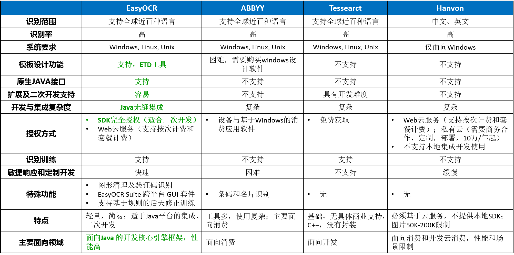

# EasyOCR

---------------

EasyOCR 是一个使用 Java 语言实现的 OCR 识别引擎（基于Tesseract）。借助几个简单的API，即能使用Java语言完成图片内容识别工作。并集成了图片清理、识别 CAPTCHA 验证码图片，票据等内容的一体化工作。

EasyOCR不仅可以为消费者提供服务，更主要面向开发，能够提供本地化的开发SDK集成，与 C/S，B/S 及 Android 移动端项目进行原生集成。

EasyOCR 4.X 新架构上线，最新版本 4.2.0。


## 主要特点

- API 极简，一个方法，一行代码即可完成

- 纯本地化SDK，JAVA原生支持，可作为引擎嵌入各种项目，支持 Android 移动端集成

- 支持 API 级别的识别白名单限定，限定识别范围

- 支持上百种语言识别，并支持混合语言识别，如：英文+日文+德文

- 专门针对常用票据、验证码图片的清理、识别一体化实现，内置多种常见类型的验证码图片选项

- 支持自定义插件，能够编写基于EasyOCR一体化识别的图片清理扩展插件

- ETD模板支持，提供图形化ETD模板设计工具(EasyTemplateDesigner)，准确可控提高识别率

- EasyOCR Suite 跨平台 GUI 套件支持，为开发人员和消费者提供设计和使用工具

- 标准输入输出，支持Socket网络接口的输入输出

- 支持识别训练，基于规则的结果修正训练，让识别准确合理，提供后天能力增长

- 性能卓越，默认纯内存运算交换

- 可脱离环境变量运行

- 跨平台支持：Window, Linux, Unix, Android

## EasyOCR 使用步骤

1. 安装引擎

2. 加入 jar 包

3. 调用 API

## EasyOCR 核心 API 

- `EasyOCR`：识别图片文字的 OCR 核心类，完成对 OCR 引擎的调用。内部完成自动清理，识别的一体化工作。支持识别，清理识别，基于模板的清理识别等方法。

- `ImageClean`：图片及验证码清理类，完成各种验证码、票据和普通图片的清理工作并输出。支持图片清理（内置几种预定义的图片清理模式可以灵活切换选择）、形变和旋转等场景，并支持场景的同时应用，来提高文字识别率。

- `Language`：EasyORC 识别语言列表，支持多语言同时混合识别。

- `TextMode`：EasyOCR 识别模式列表，支持多种类型的文字识别模式枚举选择。

- `CleanType`：验证码和普通图片过滤清理类型枚举。支持NONE不清理、CAPTCHA验证码清理、TEXT文字清理及票据等图像清理算法。


## EasyOCR Demo

### 1. 识别 Demo
  

```JAVA
EasyOCR e=new EasyOCR();
//直接识别图片内容
System.out.println(e.discern("images/demo_eurotext.png")); 
```

### 2. 验证码识别Demo

   

```JAVA
//直接识别验证码图片内容
System.out.println(e.discernAutoCleanImage("images/img_INTERFERENCE_LINE.png",ImageType.CAPTCHA_INTERFERENCE_LINE)); 
//验证码图片，经过：普通清理、形变场景自动一体化处理后，识别内容
System.out.println(e.discernAutoCleanImage("images/img_NORMAL.jpg", ImageType.CAPTCHA_NORMAL, 1.6, 0.7));
```


提示：对验证码图片进行合适的形变有助于提高识别率。在需要比例调整的特殊情况下，可通过多次分析观察获得合适比例。
```JAVA
for(double imageWidthRatio=0.8;imageWidthRatio<=2;imageWidthRatio+=0.1){
	for (double imageHeightRatio = 0.8;imageHeightRatio<=2.8;imageHeightRatio+=0.1) {
		System.out.println(e.discernAndAutoCleanImage("images/d.jpg",ImageType.CAPTCHA_NORMAL,imageWidthRatio,imageHeightRatio));
	}
}
```

### 3. API 使用Demo
```
EasyOCR ocr = new EasyOCR();

System.out.println("###### 中文会议通知内容识别 ######");
ocr.setAmendPath("amend_chi.txt"); // 中文识别修正
ocr.setLanguage(Language.CHI_SIM); // 中文语言
String res=ocr.discern("images/bank/notice.tif");
System.out.println(res);

System.out.println("###### 多语言混合识别 ######");
ocr.setLanguage(Language.multiLanguage(Language.ENG,Language.CHI_SIM)); // 多语言识别
String res2=ocr.discern("images/bank/bill2.tif");
System.out.println(res2);

System.out.println("###### 基于ETD模板的中文银行票据识别 ######");
ocr.setLanguage(Language.CHI_SIM); // 中文识别
ocr.setTextMode(TextMode.UNIFORM_TEXT); // 统一大小
List<String> res3=ocr.discernByTemplate("images/bank/bill3.jpg", "images/bank/bill.etd", ImageType.BILL_NORMAL);
System.out.println(res3);

System.out.println("###### 带图片的清理数字内容识别 ######");
ocr.setLanguage(Language.ENG); // 英文识别
ocr.setCharList("0123456789"); // 字符限定API
ocr.setTextMode(TextMode.SINGLE_LINE_TEXT); // 单行文本识别
String res4=ocr.discernAutoCleanImage("images/bank/example4.jpg",ImageType.TEXT_BOLD_BLAK);
System.out.println(res4);
```

### 4. 当前枚举的验证码列表
- `CAPTCHA_NORMAL` ：普通验证码图片
     

- `CAPTCHA_INTERFERENCE_LINE` ：带干扰线的验证码图片
   

- `CAPTCHA_SPOT` ： 点状验证码图片
       

- `CAPTCHA_WHITE_CHAR` ： 白色文字，纯色背景验证码图片
      

- `CAPTCHA_HOLLOW_CHAR` ： 空心文字验证码图片
      

- `CLEAR` ： 无特殊干扰的普通图片清晰化，提高识别率    

- `LINK_BOLD` ： 粘连的加粗字体   


## EasyOCR Suite 跨平台GUI套件
EasyOCR Suite 提供了一套面向开发模板设计（ETD 工具），消费使用（EasyOCR UI）等等场景的跨平台图形化工具。

界面设计特别针对现代UI，化繁为简，并对触摸交互做了优化。在客户体验上功能清晰，易用，无论是开发人员还是用户都可以轻而易举的使用。

- EDT工具


## 与其他商业引擎对比
与传统厂商不同，由于具有本地化SDK集成能力。EasyOCR不仅可以为消费者提供服务，更面向开发，可作为各种商业项目的内置引擎。




## 技术支持与服务


OCR 识别并不是一项存在一劳永逸解决方案的技术工作。具体识别都应当视场景进行分析优化处理，常常需要配合图片清理，特征分析提取，规则修正和一定的后天学习。银行，游戏，支付，验证码破解，不同领域需要分析以提供不同的处理方法。

EasyOCR 项目自发布以来，收到来自国内外，各个行业朋友的咨询服务，并寻求与其业务行业相关的具体解决方案。

由于在当前OCR引擎领域，与主流商业引擎对比，EasyOCR具备SDK集成能力，具备编程灵活性，功能全面，识别准确和性能卓越，已经为全球多家企业提供了引擎支持。在中文识别等领域，经过对比其他商业引擎，EasyOCR具有更高灵活性及识别率。目前商业服务的领域包括银行，爬虫应用，支付，大数据处理以及在线游戏图形数据分析处理（英国）等等领域。

**为了保护这些商业用户的利益，EasyOCR及其验证码识别 4.X 之后不再免费提供，在此为支持开源的用户抱歉，因为除了无私付出的开源精神，商业支持亦是技术前进的重大推动力，感谢理解。如果您需要交流，我们依然可以提供相应帮助。愿景于热爱开源与付出所得来的快乐，我们还会提供更多其他的开源项目推动社区进步。**

**商业用户可获取相关资料：**
- EasyOCR 开发使用手册
- EasyOCR Installation 引擎安装文档（Windows, Non-Windows）
- EasyOCR API 文档手册
- EasyOCR Plugin 扩展插件开发手册
- EasyOCR Java doc 文档

**如有任何需要请联系我们，提供引擎，本地SDK，云服务，跨平台图形设计工具，需求与方案定制，持续响应，合作等服务。**


> **OCR 技术浅谈**
> 
> OCR 技术到今天为止已经相对成熟，在一些领域已经得到广泛应用，能够为生活便利和突破。但另一方面它却并没有很多人想象的更好，这项技术也有其适应方面，在另外一些更宽泛的领域，OCR往往是作为一种更加高效的辅助手段，而并非绝对可靠的解决方案。
> 
> 对于这些场景和领域来说，识别结果就是薛定谔盒子里的猫，人工参与确认之前，状态是叠加的，既正确又不正确。所以如果在无法达到限定场景的情况下，却需要通过OCR识别得到100%准确的结果，那么在哲学和逻辑上首先是一个难题。
> 
> 一个更好的方案背后往往需要的更多配合工作，如图像清理，特征分析，辅助工具等等知识技能。OCR有时候就像一个小孩，要有容忍，也需要指导，纠正，训练，让他做的更好。
> 

<div style="display:none">

## EasyOCR 相关技术咨询服务

**价格**：￥200

**计费周期**：一天

**服务内容**：

提供 30 分钟电话支持或 1 小时的 IM(QQ, MSN...) 咨询，及当天的邮件往来支持。

可以咨询包含：

1. EasyOCR 相关的技术咨询

2. EasyOCR 使用过程中的问题协助

3. EasyOCR 其他

4. OCR 相关图形的识别分析服务

5. OCR 相关业务解决方案咨询与提供

6. OCR 技术与经验咨询

7. OCR 领域其他
</div>


## END
### [官方主页](http://www.easyproject.cn/easyocr/zh-cn/index.jsp '官方主页')

[留言评论](http://www.easyproject.cn/easyocr/zh-cn/index.jsp#donation '留言评论')

如果您有更好意见，建议或想法，请联系我。

### [The official home page](http://www.easyproject.cn/easyocr/en/index.jsp 'The official home page')

[Comments](http://www.easyproject.cn/easyocr/en/index.jsp#donation 'Comments')

If you have more comments, suggestions or ideas, please contact me.


Email：<inthinkcolor@gmail.com>

[http://www.easyproject.cn](http://www.easyproject.cn "EasyProject Home")


**支付宝钱包扫一扫捐助：**

我们相信，每个人的点滴贡献，都将是推动产生更多、更好免费开源产品的一大步。

**感谢慷慨捐助，以支持服务器运行和鼓励更多社区成员。**

</img>


We believe that the contribution of each bit by bit, will be driven to produce more and better free and open source products a big step.

**Thank you donation to support the server running and encourage more community members.**

[](https://www.paypal.me/easyproject/10 "Make payments with PayPal - it's fast, free and secure!")
